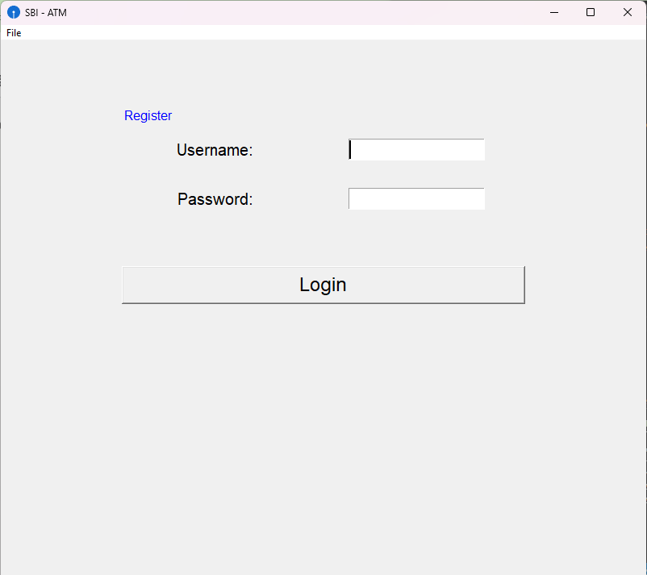

# Bank ATM Tkinter

A simple Bank ATM simulation built with Python and Tkinter, using MySQL for data storage. Features user registration, account management, and basic banking operations with a graphical interface.

[](https://opensource.org/licenses/MIT)

## Table of Contents
- [Features](#features)
- [Screenshots](#screenshots)
- [Requirements](#requirements)
- [Setup](#setup)
- [Usage](#usage)
- [Project Structure](#project_structure)
- [Technologies](#technologies)
- [Troubleshooting](#troubleshooting)
- [Contributing](#contributing)
- [License](#license)

## Features
- **User Registration**: Create accounts with name, account number, and PIN.
- **Account Management**: View balance and perform transactions.
- **Graphical Interface**: Tkinter-based UI with a custom window icon.
- **MySQL Integration**: Persistent storage for account data.

## Screenshots
| Registration Form |
|-------------------|
|  |

## Requirements
- Python 3.13 or later
- MySQL Community Server
- Git
- Code editor (e.g., PyCharm, VS Code) (optional)
- `mysql-connector-python` (installed via `requirements.txt`)

## Setup
1. Clone the repository:
   ```bash
   git clone https://github.com/johnkoshy/Bank-Atm-Tkinter.git
   cd Bank-Atm-Tkinter
   ```
2. Install Python 3.13:
   - Download from [Python 3.13.0](https://www.python.org/downloads/release/python-3130/).
   - Check "Add Python to PATH" during installation.
   - Verify installation:
     ```bash
     python --version
     ```
3. Install dependencies:
   ```bash
   pip install -r requirements.txt
   ```
4. Set up MySQL database:
   - Install and start MySQL Community Server.
   - Log into MySQL:
     ```bash
     mysql -u root -p
     ```
   - Create the database and table:
     ```sql
     CREATE DATABASE bank_atm;
     USE bank_atm;
     CREATE TABLE accounts (
         account_id INT AUTO_INCREMENT PRIMARY KEY,
         account_number VARCHAR(20) UNIQUE,
         pin VARCHAR(4),
         balance DECIMAL(10,2),
         user_name VARCHAR(100)
     );
     INSERT INTO accounts (account_number, pin, balance, user_name)
     VALUES ('1234567890', '1234', 1000.00, 'John Koshy');
     ```
5. Update database credentials in `src/main.py`:
   ```python
   db = mysql.connector.connect(
       host="localhost",
       user="root",
       password="your_password",
       database="bank_atm"
   )
   ```
6. Verify project files:
   - Ensure `main.py` and `sbi.ico` are in the `src/` folder.
   - Confirm `sbi.ico` is a valid `.ico` file for the window icon.
7. Run the application:
   - From the terminal:
     ```bash
     cd src
     python main.py
     ```
   - Or in PyCharm:
     - Open the project (`C:\Users\koshy\vstudio_prjs\Bank-Atm-Tkinter`).
     - Right-click `src/main.py` and select **Run**.

## Usage
1. Launch the application (`python main.py`).
2. Register a new account using the **Registration Form** (enter name, account number, PIN).
3. Log in with your account number and PIN.
4. View your balance or perform transactions (e.g., deposit, withdraw).

## Project Structure
- **README.md**: Project documentation.
- **requirements.txt**: Python dependencies (e.g., `mysql-connector-python`).
- **src/**:
  - **main.py**: Main application script with Tkinter UI and MySQL logic.
  - **sbi.ico**: Icon file for the Tkinter window.
- **screenshots/**: Stores app screenshots.

## Technologies
- **Python 3.13**: Programming language.
- **Tkinter**: GUI framework.
- **MySQL**: Database for account storage.
- **mysql-connector-python**: Python-MySQL connector.

## Troubleshooting
- **MySQL Errors**:
  - Ensure MySQL is running and credentials in `src/main.py` are correct.
  - Verify the `bank_atm` database and `accounts` table exist.
- **Icon Errors**:
  - Confirm `sbi.ico` is in the `src/` folder.
  - If a `TclError` occurs, ensure `sbi.ico` is a valid `.ico` file.
- **Module Errors**:
  - Reinstall dependencies:
    ```bash
    pip install -r requirements.txt
    ```

## Contributing
Contributions are welcome! 🎉 For issues, suggestions, or improvements, please open an issue or submit a pull request on [GitHub](https://github.com/johnkoshy/Bank-Atm-Tkinter/issues).

## License
This project is licensed under the [MIT License](LICENSE).